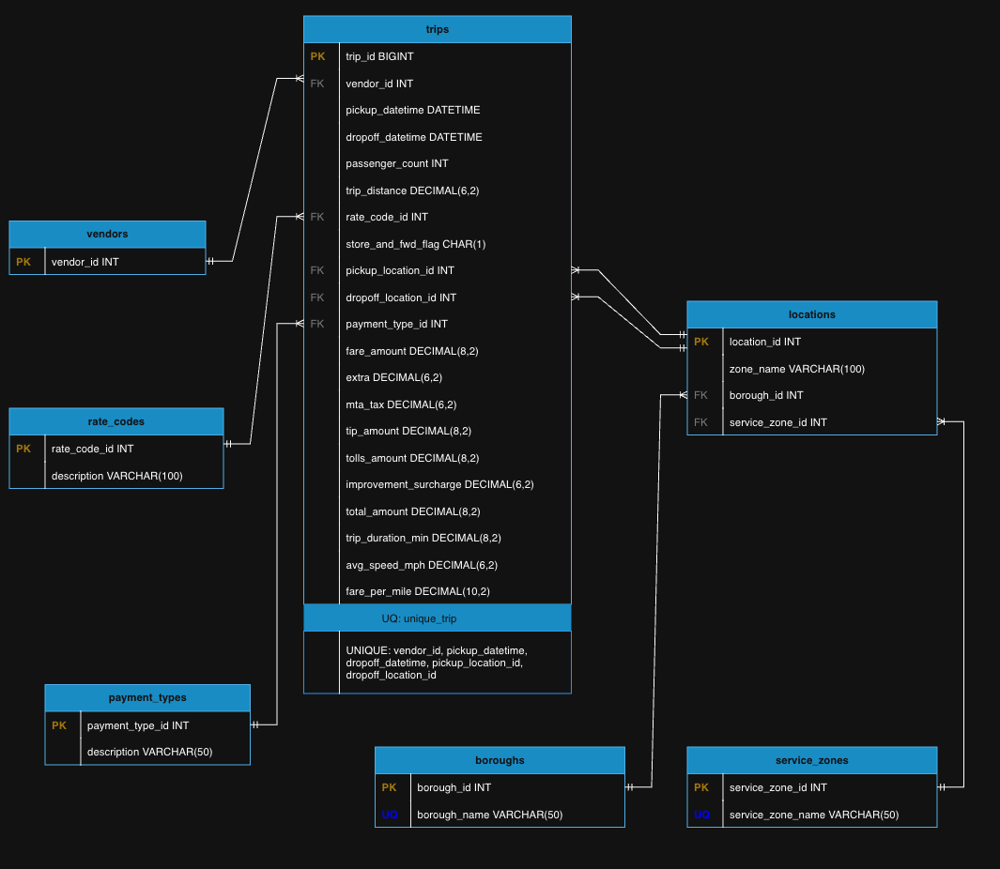

# HIT New York City Mobility Data Explorer

A full-stack data engineering and analytics platform that processes NYC taxi trip data, cleans, stores it in MySQL, exposes insights via a Flask REST API, and visualizes analytics through an interactive web dashboard.

---

# 📌 Project Overview

The **HIT New York City Mobility Data Explorer** is designed to:

* Process raw NYC taxi trip data (CSV + Shapefile)
* Clean and transform data using an ETL pipeline
* Store cleaned data in a CSV file and geojson for geolocation mapping
* Load structured data in MySQL
* Expose analytical endpoints via a Flask REST API
* Provide an interactive frontend with:

  * Summary
  * Filters (Date, Fare, Distance, Payment Type)
  * Charts (Trips, Revenue, Average Fare)
  * Interactive Map (GeoJSON using Leaflet + OpenStreetMap)

This project demonstrates full-stack data engineering, backend API development, relational database design, and frontend visualization.

---

# 🏗 High-Level System Architecture


## Architecture Layers

### 1️⃣ Raw Data

* `yellow_tripdata_2019-01.csv`
* `taxi_zone_lookup.csv`
* `taxi_zones.zip` (shapefile)

### 2️⃣ ETL Layer (`pipeline.py`)

* Load CSV & shapefile
* Clean anomalies
* Merge zone lookup
* Feature engineering
* Log removed records and cleaned records analysis
* Export:

  * `cleaned_trips.csv`
  * `taxi_zones.geojson`

### 3️⃣ Database (MySQL)

Tables:

* Boroughs
* Locations
* Payment_types
* Rate_codes
* Service_zones
* Trips
* Vendors

### 4️⃣ REST API (Flask)

* Query processing
* Filtering logic
* Aggregation & analytics logic
* Business rules
* JSON responses

### 5️⃣ Frontend

* Dashboard metric cards
* Time-series charts (Chart.js)
* Interactive map (Leaflet + GeoJSON)
* Advanced trip filtering
* Modal search results display

---

# 📂 Project Folder Structure

```
HIT_New-York-City_Mobility-Data-Explorer/
│
├── backend/
│   ├── data/
│   │   ├── taxi_zone_lookup.csv
│   │   ├── taxi_zones.zip
│   │   └── yellow_tripdata_2019-01.csv
│   │
│   ├── logs/
│   │   └── cleaning_log.txt
│   │
│   ├── processed/
│   │   ├── cleaned_trips.csv
│   │   └── taxi_zones.geojson
│   │
│   ├── app.py
│   ├── db.py
│   ├── pipeline.py
│   ├── load_data_to_sql.py
│   ├── algorithm.py
│   ├── database_setup.sql
│   └── requirements.txt
│
├── frontend/
│   ├── assets/
│   │   ├── api-data.js
│   │   ├── script.js
│   │   ├── show-charts.js
│   │   └── style.css
│   │
│   ├── images/
│   └── index.html
│
├── README.md
├── images/
│   ├── Database and system architecture images
└── requirements.txt
```

---

# ⚙️ Installation & Environment Setup

## Prerequisites

* Python 3.9+
* MySQL 8+
* pip

---

# Step 1 — Clone the Repository

```bash
git clone https://github.com/helen751/HIT_New-York-City_Mobility-Data-Explorer.git
cd HIT_New-York-City_Mobility-Data-Explorer
```

---

# Step 2 — Install MySQL

### macOS (Homebrew)

```bash
brew install mysql
brew services start mysql
```

### Ubuntu

```bash
sudo apt update
sudo apt install mysql-server
sudo systemctl start mysql
```

### Windows

Download from:
[https://dev.mysql.com/downloads/installer/](https://dev.mysql.com/downloads/installer/)

---

# 🔐 Step 3 — Configure MySQL

Login to MySQL:

```bash
mysql -u root -p
```

Create the database:

```sql
CREATE DATABASE hit_urban_mobility_db;
```

Create a dedicated user:

```sql
CREATE USER 'hit_user'@'localhost' IDENTIFIED BY 'hit_password';
GRANT ALL PRIVILEGES ON hit_urban_mobility_db.* TO 'hit_user'@'localhost';
FLUSH PRIVILEGES;
```

Exit MySQL:

```sql
EXIT;
```

---

# 🗄 Step 4 — Create Database Tables

From the project root:

```bash
mysql -u hit_user -p hit_urban_mobility_db < backend/database_setup.sql
```

---

# 📦 Step 5 — Install Python Dependencies

Create virtual environment:

```bash
python3 -m venv venv
source venv/bin/activate   # macOS/Linux
```

Install required packages:

```bash
pip install -r backend/requirements.txt
```

---

# 🧪 Step 6 — Run ETL Pipeline

Navigate to backend directory:

```bash
cd backend
```

Run:

```bash
python pipeline.py
```

This will:

* Clean raw trip data
* Generate `cleaned_trips.csv`
* Generate `taxi_zones.geojson`
* Log anomalies into `logs/cleaning_log.txt`

---

# 📥 Step 7 — Load Cleaned Data Into MySQL

```bash
python load_data_to_sql.py
```

---

# 🚀 Step 8 — Launch Backend API

From the backend directory:

```bash
python app.py
```

API will run at:

```
http://127.0.0.1:5000
```

---

# 🌐 Step 9 — Launch Frontend

Option 1 — Open directly:

Open `frontend/index.html` in your browser.

Option 2 — Run simple local server:

```bash
cd frontend
python -m http.server 8000
```

Visit:

```
http://localhost:8000
```

---

# 🔑 Database Credentials Configuration

Ensure credentials inside `backend/db.py` match your setup:

```python
connection = mysql.connector.connect(
    host="localhost",
    user="hit_user",
    password="hit_password",
    database="hit_urban_mobility_db"
)
```

---

# 📊 Features

* ETL data cleaning & anomaly logging
* Relational database schema
* RESTful analytics API
* Time-series visualizations
* Advanced filtering (date, fare, distance, payment type)
* Interactive geospatial visualization
* Responsive dashboard UI

---

# 🧰 Technologies Used

## Backend

* Python
* Flask
* MySQL
* Pandas
* GeoPandas

## Frontend

* HTML5
* CSS3
* JavaScript
* Chart.js
* Leaflet (OpenStreetMap)

---

# 🎓 Learning Outcomes

This project demonstrates:

* Data Engineering (ETL pipelines)
* Database schema design
* REST API development
* Geospatial data processing
* Data visualization
* Full-stack integration
* System architecture design

---

# 👩‍💻 Authors

Developed by:

* Helen Ugoeze Okereke
* Toluwani Oladeji
* Ikenna Onugha

---

# 📄 License

This project is developed for educational and academic purposes.


# Database Schema

## ERD

 
<a href="https://viewer.diagrams.net/?tags=%7B%7D&lightbox=1&highlight=0000ff&edit=_blank&layers=1&nav=1&title=HIT-NYC-schema.drawio&dark=auto#Uhttps%3A%2F%2Fdrive.google.com%2Fuc%3Fid%3D1mj2X9gLaWrXdCQXG60sgzsjAQdiXoT3-%26export%3Ddownload" target="_blank">View ERD on draw.io</a>

---

## Overview

This implementation loads the cleaned NYC taxi trip dataset into a structured MySQL relational database.

The loading script:

* Creates the database automatically if it does not exist
* Creates all required tables with constraints
* Applies primary keys, foreign keys, and a composite unique constraint on trips to identify a duplicate trip
* Loads relational tables first (vendors, rate codes, boroughs, service_zones, payment types and locations)
* Inserts trip records in optimized chunks (better memory usage)
* Prints progress updates while loading
* Handles all errors safely

---

## Important Requirement

Before loading the database, you **must run the cleaning pipeline first**:

```bash
python3 pipeline.py
```

This generates the cleaned dataset and stores under:

```
processed/cleaned_trips.csv
```

If the cleaned file is missing, the sql loader will stop safely and display:

```
Error: cleaned_trips.csv not found.
Run pipeline.py first to generate the cleaned CSV file.
```

---

## 🔐 Database Configuration

The loader script connects to MySQL using the following default credentials:

```python
host="localhost"
user="root"
password=""
database="HIT_urban_mobility_db"
```
- Make sure your MySQL server is running before executing the script.

## How To Load The Database

Once the cleaned CSV file exists, run:

```bash
python3 load_data_to_sql.py
```

That’s all.

The script will:

* Connect to MySQL
* Create the database (if needed)
* Create all tables
* Insert relational data
* Insert trips in batches
* Print progress while running
* Show a final summary with total records and execution time

---

## Example Output

Below is an example of what you will see while loading:

```
CSV file found. Loading data...
Database connection successful. Time started...

The data file is too large, we will load in chunks to optimize your computer memory
Now loading CSV data in chunks...

Scanning CSV in chunks completed under 25.40 seconds. Starting insert...

Relational tables populated under 0.11 seconds. Building locations...

All locations inserted in 0.02 seconds. Now inserting trips...

Inserted 10000 trips so far...
Inserted 20000 trips so far...
Inserted 30000 trips so far...
...
Inserted 7500000 trips so far...

Data successfully loaded into MySQL.

        Total number of trips inserted: 7571382
        Time used for Trip insertion: 365.54 seconds
        Total Time Used: 391.93 seconds
```

---

## Design Notes

* The database follows a normalized relational structure.
* All foreign keys are enforced.
* A composite unique constraint prevents duplicate trip entries.
* Data is inserted using `executemany()` for improved performance.
* Loading is done in chunks to prevent memory overload.
* Progress logs are printed so the user can monitor execution.
* Errors are handled safely, including missing files and connection issues.

---

## Full Setup Flow

To run everything from scratch:

```bash
python3 pipeline.py
python3 load_data_to_sql.py
```

After this, the database is fully populated and ready for querying and analysis.

